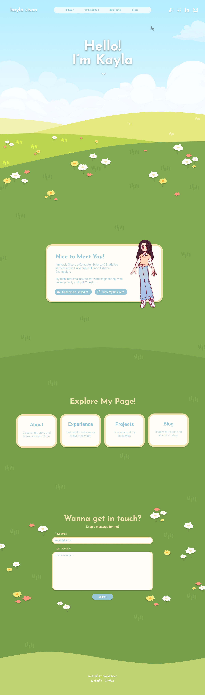
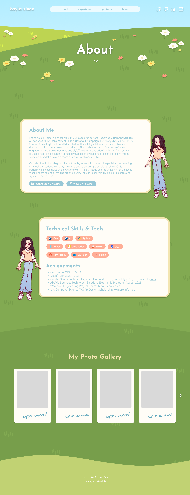
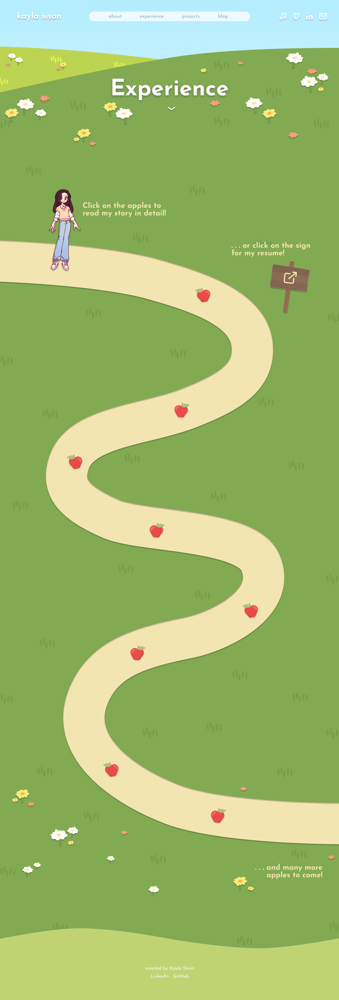

# My Personal Website

`React` `JavaScript` `HTML` `CSS` `EmailJS` `React Spring`

This project is my **portfolio and blog** site that showcases who I am as a developer, creator, and student. It's filled with my personality and style! This site combines a charming interface with clear, navigable sections to provide insight into my experience, projects, and blog.

> Designed to act as both a portfolio hub and a personal blog.
### 🚧 **Currently in development — more features, content, and deployment coming soon!**

## 🚀 Features
- 🏠 **Home**: Parallax landing page using React Spring, site navigation section, and contact section implemented with EmailJS
- 👩‍💻 **About**: Extended bio, technical skills, achievements, and photo gallery
- 💼 **Experience**: Professional timeline + downloadable resume
- 🛠️ **Projects**: Visual project showcase with descriptions
- ✍️ **Blog**: Writing space for sharing my reflections on professional experiences and projects
- ❌ **Custom 404 Page**: Friendly error page for broken links

## 🧭 Page Overview

### Home
- Short greeting and intro
- Call-to-action that prompts users to explore the page
- Contact section with email form

### About
- Extended biography
- List of technical skills & tools
- Highlights of key achievements
- Photo gallery to feature achievements and personality

### Experience
- Interactive timeline of my professional and academic journey
- Resume download/view link at the top of the page

### Projects
- Gallery-style project showcase
- Each project includes description, stack used, and links

### Blog
- My personal tech blog, where I write about my CS projects, career experiences, and other insights

## ✨ Screenshots & GIFs
#### Home scroll-through

#### Figma Designs (click for a closer look!)
<table>
<tr>
    <td></td>
    <td></td>
    <td></td>
</tr>
</table>

## License

    Copyright 2025 Kayla Sison

    Licensed under the Apache License, Version 2.0 (the "License");
    you may not use this file except in compliance with the License.
    You may obtain a copy of the License at

        http://www.apache.org/licenses/LICENSE-2.0

    Unless required by applicable law or agreed to in writing, software
    distributed under the License is distributed on an "AS IS" BASIS,
    WITHOUT WARRANTIES OR CONDITIONS OF ANY KIND, either express or implied.
    See the License for the specific language governing permissions and
    limitations under the License.